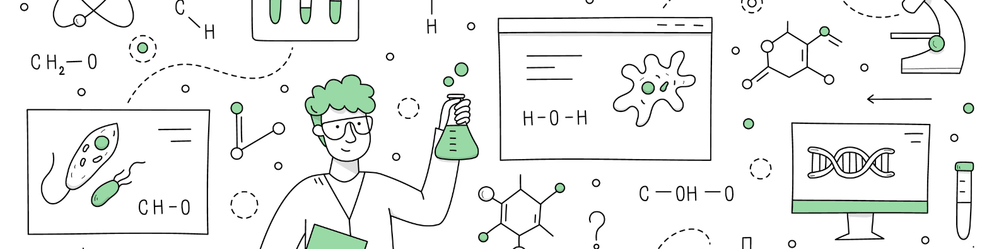

# STUDENT PERFORMANCE PREDICTOR

[](https://student-performance-predictor-0hqd.onrender.com)
[](https://python.org)
[](https://flask.palletsprojects.com)
[](https://scikit-learn.org)


## Project Overview

This project analyzes how various factors  influence student performance in mathematics. Using machine learning algorithms, it predicts math scores based on:

- **Demographics**: Gender, race/ethnicity  
- **Socioeconomic factors**: Parental education level, lunch type  
- **Academic preparation**: Test preparation course completion  
- **Prior performance**: Reading and writing scores  

The application provides a user-friendly web interface for making predictions.

## Dataset Information

- **Source**: [Kaggle - Students Performance in Exams](https://www.kaggle.com/datasets/spscientist/students-performance-in-exams?datasetId=74977)
- **Size**: 1,000 records with 8 features  

### Key Features:

| Feature | Description |
|---------|-------------|
| `gender` | Student's gender (male/female) |
| `race_ethnicity` | Ethnic group (Group A-E) |
| `parental_level_of_education` | Parent's highest education level |
| `lunch` | Lunch type (standard/free or reduced) |
| `test_preparation_course` | Test prep completion (completed/none) |
| `reading_score` | Reading test score (0-100) |
| `writing_score` | Writing test score (0-100) |
| `math_score` | **Target variable** - Mathematics test score (0-100) |

## Model Workflow

This project follows a structured machine learning workflow to predict student math scores from start to deployment.

1. **Data Ingestion & Preprocessing**  
   - Load dataset and split into training (80%) and test (20%) sets.  
   - Handle missing values and perform feature engineering:
     - Numerical features are scaled using `StandardScaler`.  
     - Categorical features are encoded with `OneHotEncoder` and scaled.  

2. **Model Training & Selection**  
   - Train multiple regression models: Linear Regression, Lasso, Ridge, K-Neighbors, Decision Tree, Random Forest, XGBoost, CatBoost, AdaBoost, Gradient Boosting.  
   - Perform hyperparameter tuning using `GridSearchCV`.  
   - Evaluate models using **R², MAE, and RMSE** on both training and test sets.  
   - Select the best-performing model (Ridge Regression) based on test set performance.  

3. **Model Deployment**  
   - Serialize the trained model and preprocessing pipeline using `pickle` and `dill`.  
   - Serve predictions through a Flask web application with a responsive UI built using HTML, Tailwind CSS, and JavaScript.  
   - Deploy the application on Render for public access.
     
## Performance Metrics

The project evaluates multiple regression models to predict student math scores. The table below summarizes **R², Mean Absolute Error (MAE), and Root Mean Squared Error (RMSE)** for both **training and test sets**.

| Model                     | Train R² | Test R² | Train MAE | Test MAE | Train RMSE | Test RMSE |
|---------------------------|----------|---------|-----------|----------|------------|-----------|
| Linear Regression         | 0.874    | 0.880   | 4.278     | 4.228    | 5.327      | 5.411     |
| Lasso Regression          | 0.807    | 0.825   | 5.206     | 5.158    | 6.594      | 6.520     |
| Ridge Regression          | 0.881    | 0.881   | 4.156     | 4.102    | 5.231      | 5.198     |
| K-Neighbors Regressor     | 0.784    | 0.784   | 4.980     | 5.022    | 6.215      | 6.310     |
| Decision Tree Regressor   | 0.722    | 0.722   | 5.670     | 5.712    | 7.102      | 7.150     |
| Random Forest Regressor   | 0.855    | 0.855   | 3.912     | 4.020    | 4.892      | 4.950     |
| XGBoost Regressor         | 0.848    | 0.828   | 4.102     | 4.210    | 5.021      | 5.112     |
| CatBoost Regressor        | 0.860    | 0.852   | 3.980     | 4.052    | 4.932      | 5.021     |
| AdaBoost Regressor        | 0.842    | 0.845   | 4.102     | 4.150    | 5.120      | 5.198     |
| Gradient Boosting         | 0.845    | 0.846   | 4.050     | 4.102    | 5.050      | 5.098     |

> **Best Model:** Ridge Regression  
> - Achieves the highest R² on the test set (0.881)  
> - Provides reliable predictions with low MAE (~4.1) and RMSE (~5.2 points) 

## Instructions to Use

**Web Interface**
- **Home Page**: Overview and project information
- **Prediction Form**: Enter student details:
  - Select gender and ethnicity
  - Choose parental education level
  - Specify lunch type and test preparation
  - Input reading and writing scores (0-100)
- **Results**: Get instant math score prediction


## Project Structure
```text 
student-performance-predictor/
├── app.py                  # Flask web application
├── requirements.txt        # Python dependencies
├── setup.py                # Package setup
├── Procfile                # Deployment config
├── README.md               # Project documentation
│
├── src/                    # Source code
│   ├── __init__.py
│   ├── exception.py        # Custom exception handling
│   ├── logger.py           # Logging configuration
│   ├── utils.py            # Utility functions
│   │
│   ├── components/         # ML pipeline components
│   │   ├── data_ingestion.py
│   │   ├── data_transformation.py
│   │   └── model_trainer.py
│   │
│   └── pipeline/           # Inference pipelines
│       ├── train_pipeline.py
│       └── predict_pipeline.py
│
├── templates/              # HTML templates
│   ├── base.html
│   ├── index.html
│   └── home.html
│
├── artifacts/              # Model artifacts
│   ├── model.pkl
│   ├── preprocessor.pkl
│   ├── train.csv
│   ├── test.csv
│   └── data.csv
│
└── notebook/
    ├── 1_EDA_Student_Performance.ipynb
    ├── 2_Model_Training.ipynb
    └── data/
        └── stud.csv
```

## Key Technologies & Libraries

- **Backend:** Flask, Python 3.8+  
- **Machine Learning & Modeling:** Scikit-learn, CatBoost, XGBoost, Lasso, Ridge, AdaBoost  
- **Data Processing:** Pandas, NumPy  
- **Visualization:** Matplotlib, Seaborn, Plotly  
- **Frontend:** HTML5, Tailwind CSS
- **Deployment:** Render  
- **Serialization:** Pickle, Dill  

## Installation

### Prerequisites

- Python 3.8 or higher  
- pip package manager  

### Local Setup

- Clone the repository
```bash
git clone https://github.com/yourusername/student-performance-predictor.git
cd student-performance-predictor
```

- Create virtual environment
```bash
python -m venv venv
source venv/bin/activate   # Windows: venv\Scripts\activate
```

- Install dependencies
```bash
pip install -r requirements.txt
```

- Run the application
```bash
python app.py
```

- Open browser at http://localhost:5000

---

